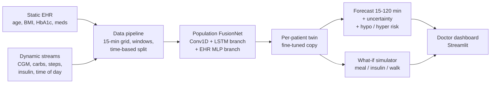

# GlucoTwin India: A Personalized Digital Twin for Type 2 Diabetes

> Folder / repo name: `<TeamName>_<CollegeName>`   *(replace before submitting)*

## 1. Team Details
| Name | Role | Email | College / Incubator |
|------|------|-------|---------------------|
| Divya Pratap Singh |Leader |sisodiyadivyapratap@gmail.com |NIT Raipur |

## 2. Project Title
**GlucoTwin India**: fusing EHR and wearable/CGM data to predict adverse glucose events (hypo/hyperglycemia) up to 2 hours ahead in Type 2 Diabetes, with a doctor-facing what-if dashboard.

## 3. Problem Statement and Healthcare Use Case
- India has one of the largest Type 2 Diabetes populations in the world, yet patients meet their doctor only a few times a year.
- Between visits, dangerous glucose excursions (< 70 or > 180 mg/dL) go unnoticed.
- Doctors see static reports, not a living picture of the patient.

**Our digital twin** is a virtual replica of each patient that
1. **fuses** static data (EHR: age, BMI, HbA1c, diabetes duration, medication, BP) with dynamic data (CGM, meal logs, steps, insulin, time of day),
2. **predicts** glucose for the next 2 hours (15-min steps) plus the probability of a hypo / hyper event, with uncertainty,
3. **personalizes** itself to each patient (fine-tuning on the patient's own data),
4. lets a doctor **simulate "what if"** the patient eats X g carbs, takes Y units of insulin or goes for a walk.

## 4. Architecture
Diagram file: `docs/architecture.pdf` (export from PowerPoint / draw.io).



## 5. Technical Stack
Python 3.10+, PyTorch, NumPy, pandas, SciPy, scikit-learn, Plotly, Streamlit.

## 6. AI/ML Model Details
| Component | Method |
|-----------|--------|
| Input window | last 6 h (24 x 15-min steps) of glucose, carbs, steps, insulin, hour-of-day (sin/cos) |
| Dynamic branch | 2x Conv1D (+BatchNorm) feature extractor -> LSTM (64 units) |
| Static branch | MLP over 8 EHR features |
| Fusion | concatenate both embeddings -> dense layer with dropout |
| Outputs | glucose at +15 ... +120 min (8 values) and P(hypo), P(hyper) |
| Loss | MSE (glucose) + BCE (events) |
| Personalization | copy population model, freeze Conv layers, fine-tune on one patient |
| Uncertainty | Monte-Carlo Dropout (30 samples) |
| What-if | learned counterfactual: edit the "now" step of the input window and re-predict |
| Split | per patient, by time: first 70% train / next 10% validation / last 20% test (no leakage) |

## 7. Datasets (anonymized / synthetic only, as required by the challenge)
| Data | Source | Notes |
|------|--------|-------|
| EHR + CGM + logs | `src/synth.py` (our own generator) | 40 virtual T2D patients x 30 days, 15-min sampling. A mechanistic glucose-insulin simulator whose parameters depend on EHR (HbA1c, BMI, duration, metformin). Contains sensor noise and gaps. **Synthetic.** |
| (planned) real CGM + clinical data | Shanghai T2DM open dataset | Needs a converter to the schema in `src/data.py`. Check the dataset license before use. |

## 8. Results (on the synthetic test period)
Forecast error, RMSE in mg/dL (lower is better):

| Model | +30 min | +60 min | +120 min |
|-------|--------:|--------:|---------:|
| Persistence (baseline) | 16.9 | 28.9 | 41.2 |
| Ridge regression | 9.2 | 18.7 | 26.9 |
| FusionNet: CGM only | 10.6 | 20.5 | 28.6 |
| FusionNet: CGM + logs | 9.4 | 17.5 | 24.9 |
| FusionNet: CGM + EHR | 10.2 | 19.5 | 26.8 |
| **FusionNet: CGM + logs + EHR (full)** | **9.2** | **17.1** | **23.3** |

Early warning of a NEW event (only windows where glucose is currently in range), AUROC:

| Model | Hypo | Hyper |
|-------|-----:|------:|
| Persistence | 0.77 | 0.69 |
| Ridge | 0.90 | 0.81 |
| **FusionNet (full)** | **0.98** | **0.93** |

Take-aways: (1) adding EHR helps (CGM only 20.5 -> CGM+EHR 19.5 RMSE at +60 min), (2) adding meal/insulin/activity logs helps more, (3) both together are best, (4) a simple ridge model is already strong at +30 min, so the deep model's advantage shows mainly at longer horizons and for event detection.
Personalization (fine-tuning per patient) lowered the mean +60 min RMSE from 16.57 to 16.17 mg/dL and helped 70% of patients (Wilcoxon p = 0.0001). The gain is small; we report it honestly.

## 9. How to Run
```bash
git clone <repo-url> && cd <repo-folder>
python -m venv venv && source venv/bin/activate      # Windows: venv\Scripts\activate
pip install -r requirements.txt

python -m src.synth --patients 40 --days 30          # 1. generate synthetic cohort (seconds)
python -m src.train --epochs 40                      # 2. baselines + ablation, saves models/fusion_full.pt
python -m src.personalize                            # 3. per-patient twins
streamlit run app/dashboard.py                       # 4. doctor dashboard
```
A trained `models/fusion_full.pt` is included, so step 4 works right after step 1.

## 10. Repository Structure
```
├── README.md
├── LICENSE
├── requirements.txt
├── data/synthetic/   # generated cgm.csv + ehr.csv
├── models/           # trained model + scaler
├── results/          # metrics.csv, personalization.csv
├── src/
│   ├── synth.py      # synthetic cohort generator
│   ├── data.py       # loading, windows, split, scaling
│   ├── model.py      # FusionNet + MC-Dropout
│   ├── engine.py     # training helpers
│   ├── train.py      # baselines + ablation
│   ├── personalize.py# per-patient fine-tuning
│   ├── whatif.py     # what-if simulation
│   └── metrics.py
├── app/dashboard.py  # Streamlit dashboard
└── docs/             # architecture.pdf, presentation.pdf
```

## 11. Deliverables Checklist
- [ ] Team details (fill section 1)
- [x] Problem statement, tech stack, model details
- [ ] Demo video, 20+ minutes (PPT recording or unlisted YouTube): (add link)
- [ ] Open-source license details (section 12)
- [ ] Architecture diagram PDF/PPT in `docs/`
- [ ] Presentation PDF/PPT in `docs/`

## 12. License
Code: (state your license, e.g. Apache 2.0 or MIT; it must match the `LICENSE` file in the repo).

Third-party libraries: PyTorch (BSD-style), NumPy / pandas / SciPy / scikit-learn (BSD), Plotly (MIT), Streamlit (Apache 2.0).

Ideas credited: Prendin et al., IEEE TBME 2025 (digital-twin-based data augmentation); Barbiero et al., "Digital Patient" (graph-based patient twin). No code from these projects is copied.

## 13. Limitations, Privacy and Ethics
- All data is **synthetic**. Results show the method works end to end, **not** clinical accuracy. Real validation needs real, consented, anonymized data.
- The what-if feature is a learned counterfactual, not a validated physiological simulator.
- Designed with the DPDP Act in mind (no real patient data, data minimization, local processing). Research prototype, **not a medical device**.

## 14. References
- Prendin F., Facchinetti A., Cappon G., "Data Augmentation via Digital Twins to Develop Personalized Deep Learning Glucose Prediction Algorithms for Type 1 Diabetes in Poor Data Context," IEEE TBME, 2025.
- Cappon G. et al., "ReplayBG," IEEE TBME, 2023.
- Barbiero P., Viñas Torné R., Liò P., "Graph representation forecasting of patient's medical conditions: towards a digital twin," 2020.
