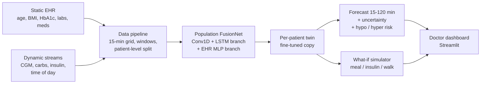

# GlucoTwin India: A Personalized Digital Twin for Type 2 Diabetes

> Repository: `Swabhimaan_NITRR` (team Swabhimaan, NIT Raipur). Submission for the Happiest Health *Digital Twin Challenge 2026*.

## 1. Team Details
| Name | Role | Email | College / Incubator |
|------|------|-------|---------------------|
| Divya Pratap Singh | Team Leader | sisodiyadivyapratap@gmail.com | NIT Raipur |

Team name: **Swabhimaan**

## 2. Project Title
**GlucoTwin India**: fusing EHR and wearable/CGM data to predict adverse glucose events (hypo/hyperglycemia) up to 2 hours ahead in Type 2 Diabetes, with a doctor-facing what-if dashboard.

## 3. Problem Statement and Healthcare Use Case
- India has one of the largest Type 2 Diabetes populations in the world, yet patients meet their doctor only a few times a year.
- Between visits, dangerous glucose excursions (< 70 or > 180 mg/dL) go unnoticed.
- Doctors see static reports, not a living picture of the patient.

**Our digital twin** is a virtual replica of each patient that
1. **fuses** static data (EHR: age, sex, BMI, HbA1c, diabetes duration, medication, labs) with dynamic data (CGM, meal logs, insulin, time of day; steps where available),
2. **predicts** glucose for the next 2 hours (15-min steps) plus the probability of a hypo / hyper event, with uncertainty,
3. **personalizes** itself to each patient (fine-tuning on the patient's own data),
4. lets a doctor **simulate "what if"** the patient eats X g carbs or takes Y units of insulin.

The Streamlit dashboard shows, for one selected patient: the past 6 h of CGM, the 2-hour forecast with an uncertainty band, hypo/hyper risk, a patient card with EHR values, a what-if panel (carbs / insulin / walk), and a clinic triage table that ranks all patients by predicted risk.

## 4. Architecture
Diagram file: `docs/architecture.pdf`



## 5. Technical Stack
Python 3.10+, PyTorch, NumPy, pandas, SciPy, scikit-learn, Plotly, Streamlit, openpyxl / xlrd (to read the Shanghai Excel files).

## 6. AI/ML Model Details
| Component | Method |
|-----------|--------|
| Input window | last 6 h (24 x 15-min steps) of glucose, logged carbs and insulin, hour-of-day (sin/cos); steps too on the synthetic data (the real dataset has none) |
| Dynamic branch | 2x Conv1D (+BatchNorm) feature extractor -> LSTM (64 units) |
| Static branch | MLP over EHR features (8 on synthetic data; 12 on Shanghai: age, sex, BMI, HbA1c, diabetes duration, insulin / metformin use, fasting and 2 h glucose, C-peptide, eGFR). Gaussian noise on the EHR vector during training stops the network from memorizing individual patients |
| Fusion | concatenate both embeddings -> dense layer with dropout |
| Outputs | glucose at +15 ... +120 min (8 values) and P(hypo), P(hyper) |
| Loss | MSE (glucose) + 0.5 x BCE (events) |
| Personalization | copy population model, freeze Conv layers, fine-tune on one patient's own early data |
| Uncertainty | Monte-Carlo Dropout (30 samples) |
| What-if | learned counterfactual: edit the "now" step of the input window and re-predict |
| Split | synthetic: per patient by time (70 / 10 / 20). Real data: by PERSON (70 / 10 / 20 people); test people are never seen in training |
| Baselines | persistence (future = now) and ridge regression |
| Ablation | 2 x 2: CGM only / CGM + logs, each without / with EHR |

## 7. Datasets (anonymized / open / synthetic only, as required by the challenge)
| Data | Source | Notes |
|------|--------|-------|
| **Real CGM + clinical data (main results)** | Shanghai T2DM dataset: Zhao Q. et al., "Chinese diabetes datasets for data-driven machine learning", *Scientific Data* 10, 35 (2023). Licence CC BY 4.0. [figshare](https://doi.org/10.6084/m9.figshare.c.6310860) | 100 patients / 109 CGM records, 15-min CGM, diet log, insulin log, demographics and lab values. Hospital inpatients in China, used as a **proxy** because no open Indian CGM dataset exists. `src/convert_shanghai.py` converts it to our schema. The converted files are in `data/shanghai/` (with attribution). |
| Synthetic cohort (sanity check, demo) | `src/synth.py` (our own generator) | 40 virtual T2D patients x 30 days with a mechanistic glucose-insulin simulator. **Synthetic.** |

What `src/convert_shanghai.py` derives (so these inputs are **approximate**, see Limitations):
- **Carbs**: estimated from the free-text diet log with a hand-made food table (`data/food_carbs.csv`). 20% of meals say "data not available" and get the median meal of that time of day; 7% of food weight had no match in our table at first run (mostly low-carb items, table extended afterwards).
- **Insulin**: parsed from the text log and split into fast / premixed and long-acting (basal). Pump basal rate and i.v. insulin are ignored.
- **HbA1c**: converted from mmol/mol to % (NGSP = 0.09148 x IFCC + 2.152). Missing lab values are filled with the *training-set* mean.
- The "Hypoglycemia (yes/no)" column of the summary sheet is **deliberately not used** (it could describe the very period we predict, which would leak the answer).
- No step / activity data exists in this dataset, so the activity input is absent in the real-data model.

**Split:** whole *people* go to train / validation / test (70 / 10 / 20 people = 75 / 11 / 23 records, 74k / 11k / 24k windows). The test people are never seen in training. Scaler and imputation use training data only.

## 8. Results

### 8a. Real data (Shanghai T2DM), test = 20 unseen patients
RMSE in mg/dL (lower is better). The 95% CI of RMSE at +60 min comes from a bootstrap over records.

| Model | +30 min | +60 min (95% CI) | +120 min |
|-------|--------:|------------------|---------:|
| Persistence (baseline) | 17.6 | 29.6 (27.0 - 32.4) | 45.2 |
| Ridge regression | 13.3 | 24.2 (22.1 - 27.1) | 37.5 |
| FusionNet: CGM only | 14.3 | 25.2 (22.7 - 28.3) | 38.3 |
| FusionNet: CGM + logs | 14.0 | 24.4 (21.9 - 27.3) | 36.8 |
| FusionNet: CGM + EHR | 14.0 | 24.9 (22.8 - 27.5) | 38.2 |
| FusionNet: CGM + logs + EHR (full) | 14.9 | 24.6 (22.6 - 27.1) | 36.7 |

Early warning of a NEW event in the next 2 h (only windows where glucose is currently 70-180 mg/dL; 693 hypo windows = 4.2%, 2905 hyper windows = 17.6%):

| Model | Hypo AUROC | Hypo sens. @ 90% spec. | Hyper AUROC | Hyper sens. @ 90% spec. |
|-------|-----------:|-----------------------:|------------:|------------------------:|
| Persistence | 0.79 | 0.49 | 0.74 | 0.37 |
| Ridge | 0.84 | 0.60 | 0.82 | 0.54 |
| FusionNet: CGM only | 0.90 | 0.74 | 0.80 | 0.50 |
| FusionNet: CGM + logs | 0.91 | 0.79 | 0.86 | 0.56 |
| FusionNet: CGM + EHR | 0.91 | 0.77 | 0.78 | 0.45 |
| FusionNet: full | 0.86 | 0.57 | 0.84 | 0.50 |

**Personalization** (per-patient twin: copy of the population model, conv layers frozen, fine-tuned on the first half of the patient's record, evaluated on the second half; 23 unseen records): mean RMSE at +60 min 22.7 -> 21.2 mg/dL, at +120 min 33.0 -> 30.2 mg/dL; it helped 74% of records (Wilcoxon p = 0.0035).

All numbers are saved in `results/shanghai/metrics.csv` and `results/shanghai/personalization.csv`.

**What we can and cannot claim (honest reading):**
1. All learned models beat persistence: about 16-18% lower RMSE at +60 min and about 19% at +120 min, and clearly better hypo / hyper early warning (hypo AUROC 0.86-0.91 vs 0.79).
2. With only 100 patients we could **not** show that the deep FusionNet beats a plain ridge regression on RMSE: the 95% intervals of all learned models overlap. We do not claim otherwise.
3. Adding EHR features did **not** measurably improve accuracy on this small dataset (CGM only 25.2 vs CGM + EHR 24.9, within noise). The full model's hypo AUROC (0.86) is lower than the CGM + logs model (0.91); AUROCs have no confidence interval here and come from correlated, overlapping windows of 23 records, so differences of a few points are not reliable.
4. The clearest, statistically supported gain is **personalization** (+60 min RMSE -7%, p = 0.0035).
5. The project's value is the integrated, working pipeline: EHR + wearable fusion, uncertainty (MC-Dropout), adverse-event prediction, what-if simulation and the doctor dashboard, evaluated honestly on unseen patients.

### 8b. Synthetic data (sanity check)
On our synthetic cohort the full model gives the best RMSE and event AUROC, which shows the pipeline works end to end when the signal is strong. These numbers are **not** evidence of clinical accuracy. Re-create them with `python -m src.synth` followed by `python -m src.train`.

## 9. How to Run
```bash
git clone https://github.com/dps-nitrr/Swabhimaan_NITRR.git && cd Swabhimaan_NITRR
python -m venv venv && source venv/bin/activate      # Windows: venv\Scripts\activate
pip install -r requirements.txt

# Option A: real data is already converted in data/shanghai/ and a trained model is in models/shanghai/
streamlit run app/dashboard.py                       # doctor dashboard (sidebar: real / synthetic data)

# Option B: re-run everything
python -m src.synth --patients 40 --days 30          # synthetic cohort (seconds)
python -m src.train --epochs 40
python -m src.personalize

# Real data from scratch: download Shanghai T2DM (CC BY 4.0) from figshare, unzip to data/raw/shanghai/, then
python -m src.convert_shanghai --raw data/raw/shanghai --out data/shanghai
python -m src.train --data data/shanghai --models models/shanghai --results results/shanghai --epochs 40
python -m src.personalize --data data/shanghai --models models/shanghai --results results/shanghai
```
Training runs on CPU in minutes; a GPU is used automatically if PyTorch can see one.

## 10. Repository Structure
```
├── README.md
├── LICENSE
├── requirements.txt
├── data/
│   ├── synthetic/        # generated cgm.csv + ehr.csv
│   ├── shanghai/         # converted real data (CC BY 4.0, see its README.md)
│   └── food_carbs.csv    # approximate carbs per food, used by the converter
├── models/               # trained model + scaler (models/shanghai for real data)
├── results/              # metrics.csv, personalization.csv (results/shanghai for real data)
├── src/
│   ├── synth.py          # synthetic cohort generator
│   ├── convert_shanghai.py # Shanghai T2DM -> our format
│   ├── inspect_shanghai.py # dataset diagnostic helper
│   ├── data.py           # loading, windows, split, scaling
│   ├── model.py          # FusionNet + MC-Dropout
│   ├── engine.py         # training helpers
│   ├── train.py          # baselines + ablation
│   ├── personalize.py    # per-patient fine-tuning
│   ├── whatif.py         # what-if simulation
│   └── metrics.py
├── app/dashboard.py      # Streamlit dashboard
└── docs/                 # architecture.pdf, presentation.pdf
```

## 11. Deliverables Checklist
- [x] Team details (section 1)
- [x] Problem statement, tech stack, model details
- [ ] Demo video, 20+ minutes (PPT recording or unlisted YouTube): (add link)
- [x] Open-source license details (section 12)
- [ ] Architecture diagram PDF/PPT in `docs/`
- [ ] Presentation PDF/PPT in `docs/`

## 12. License
Code: MIT License (see the `LICENSE` file in this repository).

Data: the converted Shanghai T2DM files in `data/shanghai/` are derived from a CC BY 4.0 dataset (Zhao et al., 2023); attribution is in `data/shanghai/README.md`.

Third-party libraries: PyTorch (BSD-style), NumPy / pandas / SciPy / scikit-learn (BSD), Plotly (MIT), Streamlit (Apache 2.0).

Ideas credited: Prendin et al., IEEE TBME 2025 (digital-twin-based data augmentation); Barbiero et al., "Digital Patient" (graph-based patient twin). No code from these projects is copied.

## 13. Limitations, Privacy and Ethics
- The real data are **Chinese hospital inpatients**, not Indian outpatients: diet, medication and glycaemic patterns differ. Results show the method works on real CGM, **not** that it is validated for Indian patients. Validation on Indian, consented, anonymized data is the next step.
- Meal carbohydrates are **estimated** from free-text diet logs (and 20% of meals are imputed), insulin doses are parsed from text, and there is no activity data. The what-if effects of carbs / insulin are therefore only as good as these approximations.
- Small dataset (100 patients, short records): no significant advantage of the deep model over ridge regression was found, EHR features gave no measurable gain, and AUROC values have no confidence intervals. Hypo events are rare (4.2% of in-range windows).
- The what-if feature is a **learned counterfactual**, not a validated physiological simulator, and was not validated against real interventions.
- Designed with the DPDP Act in mind (only open, anonymized or synthetic data, data minimization, local processing). Research prototype, **not a medical device and not medical advice**.

## 14. References
- Zhao Q., Zhu J., Shen X. et al., "Chinese diabetes datasets for data-driven machine learning," *Scientific Data* 10, 35 (2023). Data licensed CC BY 4.0, https://doi.org/10.6084/m9.figshare.c.6310860
- Prendin F., Facchinetti A., Cappon G., "Data Augmentation via Digital Twins to Develop Personalized Deep Learning Glucose Prediction Algorithms for Type 1 Diabetes in Poor Data Context," IEEE TBME, 2025.
- Cappon G. et al., "ReplayBG," IEEE TBME, 2023.
- Barbiero P., Viñas Torné R., Liò P., "Graph representation forecasting of patient's medical conditions: towards a digital twin," 2020.
